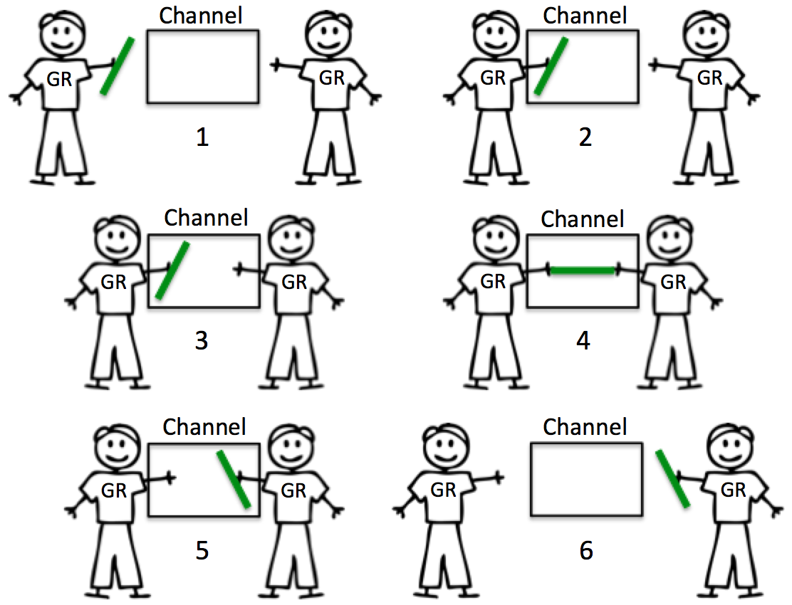

## 总结
[博文](https://go101.org/article/channel.html)
* channel是`指针`(`引用`)传递。
* 分为无缓冲区和有缓冲区。
* 无缓冲区是Hand By Hand的。

* 有缓冲区类似有大小的队列。为空则读阻塞，满则写阻塞。

* 读close的channel会马上返回默认值和false。可以多次读。多个gorouting都会读到。可以用作广播消息。
* 写close的channel会panic。
* close已经关闭的channel会panic。
* 使用select可以异步***读、写***。
* for range可以达到for + <-ch读的效果，当关闭的时候退出。
* struct{}空结构体，可作为通知消息，比如关闭消息。
* len,cap是线程安全的，但是取了之后通常就会改变。
* 传递是值传递，copy。写一次，读一次。
* 严格的FIFO队列。
* When a goroutine sends a value to a channel, we can view the goroutine releases the ownership of some values. When a goroutine receives a value from a channel, we can view the goroutine acquires the ownerships of some values