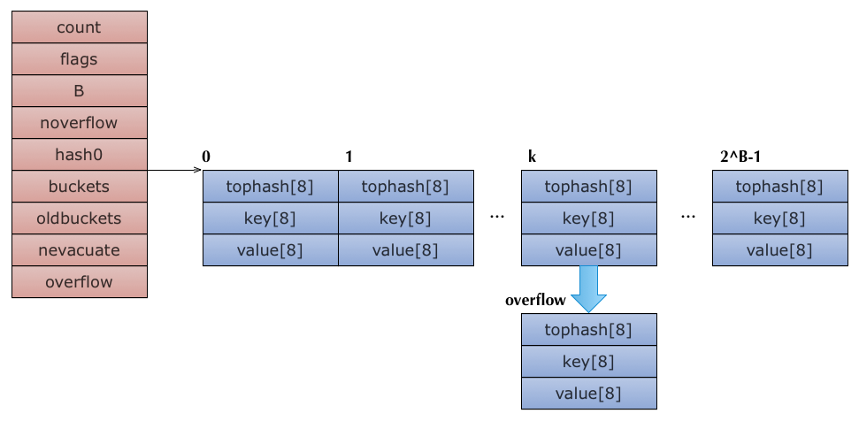

## 总结
* map不是线程安全的。
* map是一个HashTable，使用链表解决Hash冲突，查找效率为O(1)。
* map是`指针`(`引用`)传递。
* 扩容发生在添加，删除，修改的时候，并且一次只搬迁1到2个bmap。
* 遍历map是无序的。
* key的类型可以为bool,numeric,string,pointer,channel,interface,array,struct这些可以比较(==)的。不能为slice,map,func。
* map不会收缩[不再使用]的空间。GC时key,value如果是带有指针字段，则会扫描，这也是为什么value有指针比没有指针gc慢。
## 使用建议
* 用string和numeric的类型为key是有优化的，float由于精度问题，需要注意。
* 根据使用场景，控制map的大小，或者将大map分片[]map[interface]interface{}。
## Map 结构
其底层数据结构为HashTable，使用链表解决Hash冲突。定义在runtime/map.go中  

[博文1](https://aimuke.github.io/go/2019/05/16/map/) [博文2](https://studygolang.com/articles/21047?fr=sidebar) 可参考
## 初始化
* 在编译时，不管是make创建的map，还是直接初始化(map[int]string{})都会返回*指针*。
````
	m := make(map[string]int)
	m["1"] = 1
	fmt.Println("map:", m)
	add(m)
	fmt.Println("map:", m)
	n := map[string]int{"1": 1, "2": 2}
	fmt.Println("map:", n)
	add(n)
	fmt.Println("map:", n)
	/*
		map: map[1:1]
		add map: map[1:1 22:22]
		map: map[1:1 22:22]
		map: map[1:1 2:2]
		add map: map[1:1 2:2 22:22]
		map: map[1:1 2:2 22:22]
	*/
````
````
func add(ma map[string]int) {
	ma["22"] = 22
	fmt.Println("add map:", ma)
}
````
* 为了内存紧凑和快速查找，一个bmap中有[8]topHash，[8]keys和[8]values。
* 为了提高效率，创建的bmap为2的B次幂。
## 查找
* 根据key生成hash,将hash分成高八位(topHash)，和低B位。
* 通过对低B位取模(优化为位运算)，得到hash桶的编号。如果正在扩容，并且这个bucket还没搬到新的hash表中，那么就从老的hash表中查找(通过topHash[0]判断)。
* 快速遍历topHash，找到相等的再进一步比较key是否相等。相等则返回value，不等则遍历此bmap的下一个bmap。
* 遍历同一个桶的所有bmap都没有相等的key，则返回value的零值。
## 插入
* 在定位到bucket后，如果正在扩容，并且当前bmap没有搬迁，进行搬迁。
* 在bucket中寻找key，同时记录下第一个空位置，如果找不到，那么就在空位置中插入数据；如果找到了，那么就更新对应的value。
* 找不到key就看需不需要扩容，需要扩容并且没有正在扩容，那么就进行扩容，然后回到第一步。
* 找不到key，不需要扩容，但是没有空slot，那么就分配一个overflow bucket挂在链表结尾，用新bucket的第一个slot放存放数据。
## 删除
* 如果正在扩容，并且要操作的bucket没有搬迁完，搬迁此bucket。
* 找到对应的topHash位置，设置为empty。如果key和value包含了指针则释放指针指向的内存。
## 扩容
1. ###扩容的方式  
    * 相同容量的扩容:  
    在map不断的插入和删除后，可能导致overflow过多，中间槽位很多为空，不利于遍历key。此时需要将slot变得更加紧凑。
    * 两倍容量的扩容:  
    空间确实不够用了，需要扩容到原来的两倍。  
2. ### 扩容的条件  
    * overflow的bucket数量过多，对应相同容量扩容。
    * 装载因子过大，对应两倍容量扩容。

    