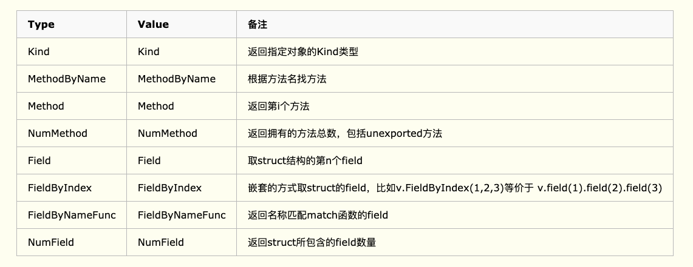
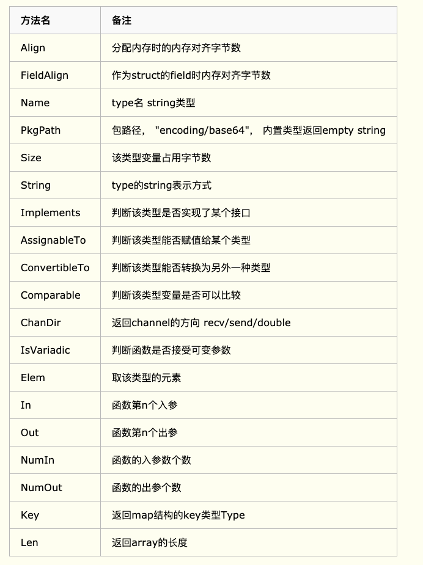
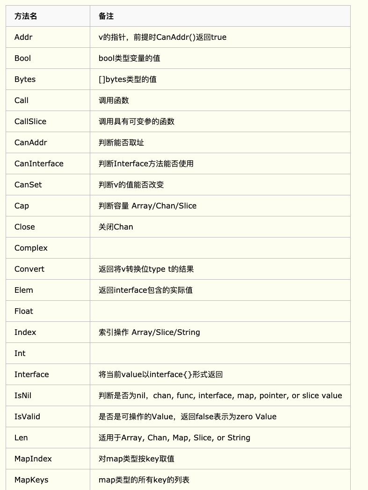
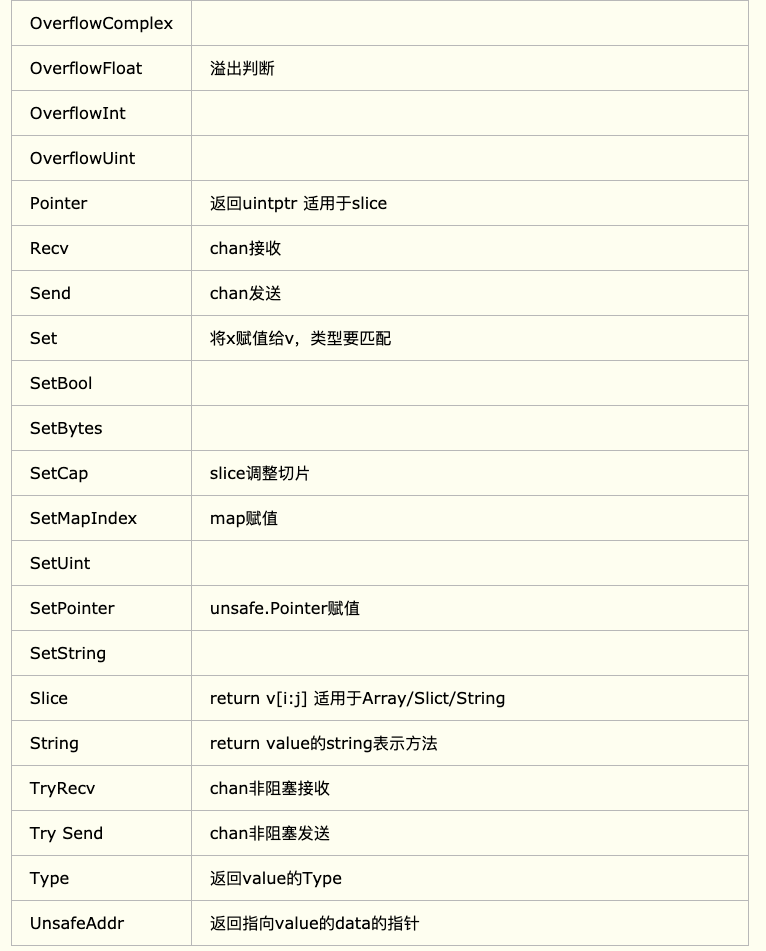

##总结
* 两种操作，TypeOf(对类型操作)和ValueOf(对值操作)。
* 即使是传递指针的指针，得到的Kind也是ptr。使用Elem()相当于*ptr，所以多有递归处理。对非指针类型再取Elem()，则panic。
* 要改变值，应该传递ValueOf(&v)，在取Elem()，类似指针传递,在*p=v赋值。注意结构体中的匿名字段。
* 同样，要改变指针指向的值，需要传递指针的指针。在取Elem()，改变指针指向的值。
* reflect.Value可以转化为interface，v.Interface().(Car)。
* reflect.Interface类型在切片和map是interface{}类型的Kind时。
## Type和Value拥有的同名方法

## Type独有的方法

## Value独有的方法
  

